# 📊 Sales Performance Dashboard (Power BI)

A comprehensive end-to-end Power BI project for analyzing sales performance across multiple dimensions including time, product, brand, and geography.

This dashboard leverages advanced **DAX calculations**, **time intelligence**, and a **star schema data model** to deliver actionable business insights.

----

## 📂 Power BI Dashboard

Due to file size limitations, the Power BI file is hosted on Google Drive.

👉 [Download Power BI Dashboard](https://drive.google.com/file/d/1vjJ6R9vffpMPWrhaW_1CmcIOnRJHJ8wt/view?usp=drive_link)

# 📊 Sales Analysis Dashboard (Power BI)

This project presents a comprehensive sales analysis dashboard built in Power BI.  
It provides insights into sales performance, trends, growth patterns, and comparisons across time, brands, and currencies.

---

## 📌 Key Features
- Multi-currency analysis (EUR, USD, GBP, CAD, AUD)
- Time-based metrics (MTD, QTD, YTD, STD)
- Year-over-Year comparisons
- Running totals and growth analysis
- Seasonal trend evaluation
- Product and brand performance insights

---

## 🏗 Data Model

The dashboard is built using a **star schema**:

- Fact Table: Sales
- Dimension Tables:
  - Date
  - Product
  - Customer
  - Store
  - Currency

This structure ensures efficient performance and scalable analytics.

----

## 📊 Dashboard Sections

---

### 1. KPI Overview Dashboard
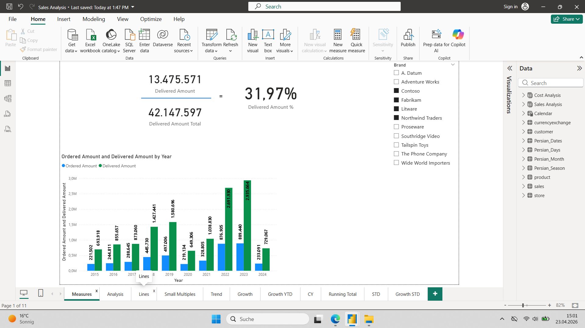

This section provides a high-level summary of key performance indicators, including total delivered amount and its percentage relative to overall sales.

It enables quick assessment of overall business performance and highlights the relationship between delivered and total sales.

---

### 2. Brand and Product Performance Analysis
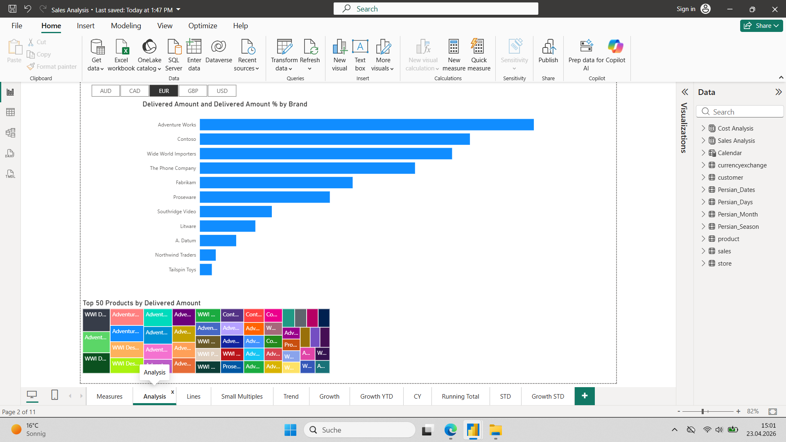

This section analyzes delivered amount by brand and highlights the top-performing products.

It helps identify leading brands and key contributors to revenue, supporting better product and portfolio decisions.

---

### 3. Sales Performance Trends Over Time
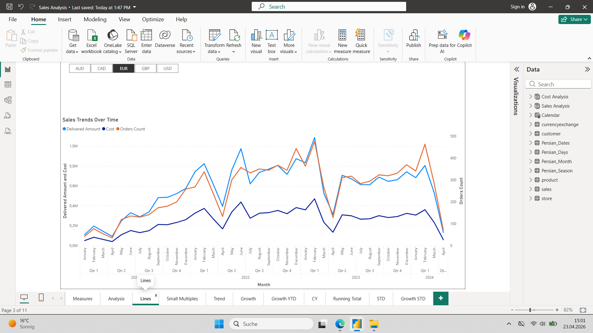

This visualization shows how delivered amount, cost, and order count evolve over time.

It reveals trends, seasonality, and potential anomalies in sales behavior.

---

### 4. Delivered Amount Trend (QTD & YTD)
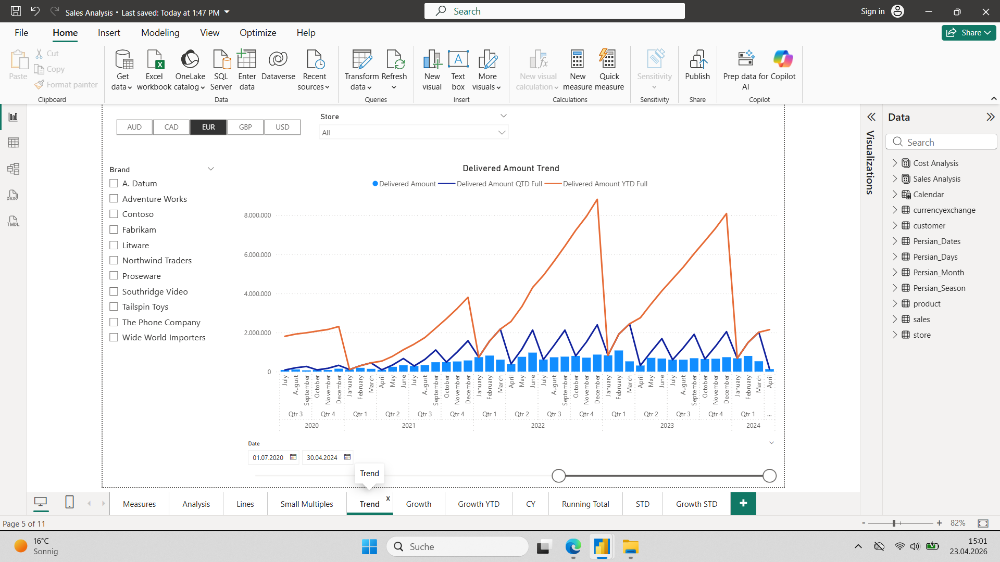

This section compares delivered amount trends across QTD and YTD.

It provides insights into short-term vs long-term performance and helps detect growth acceleration or slowdowns.

---

### 5. KPI Comparison (MTD, QTD, STD, YTD vs Last Year)
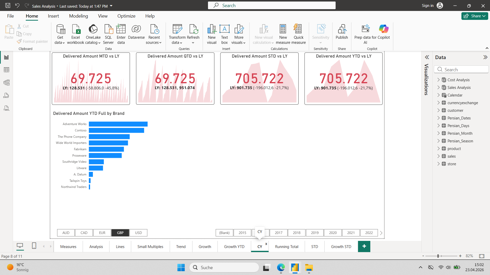

This section compares key metrics against last year across different time aggregations.

It highlights performance changes and helps evaluate business growth or decline.

---

### 6. Monthly Sales and Growth Analysis
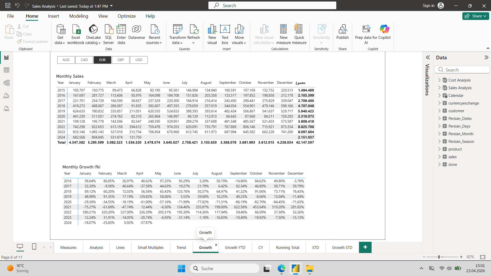

This table presents monthly sales values along with growth percentages.

It allows detailed month-by-month analysis and helps identify high-performing periods.

---

### 7. Year-to-Date (YTD) Sales and Growth
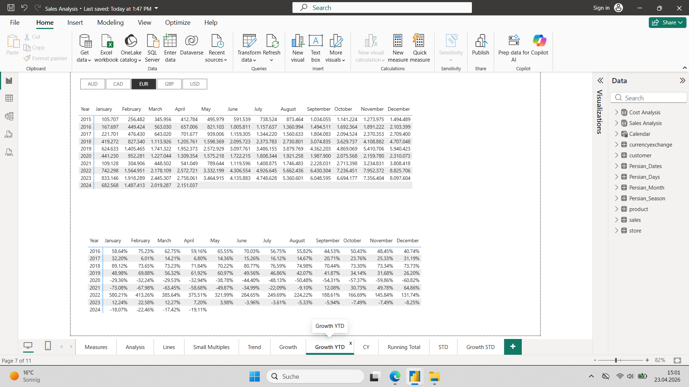

This section focuses on YTD performance and growth trends.

It supports tracking cumulative yearly progress and evaluating overall business trajectory.

---

### 8. Running Total Sales Trend
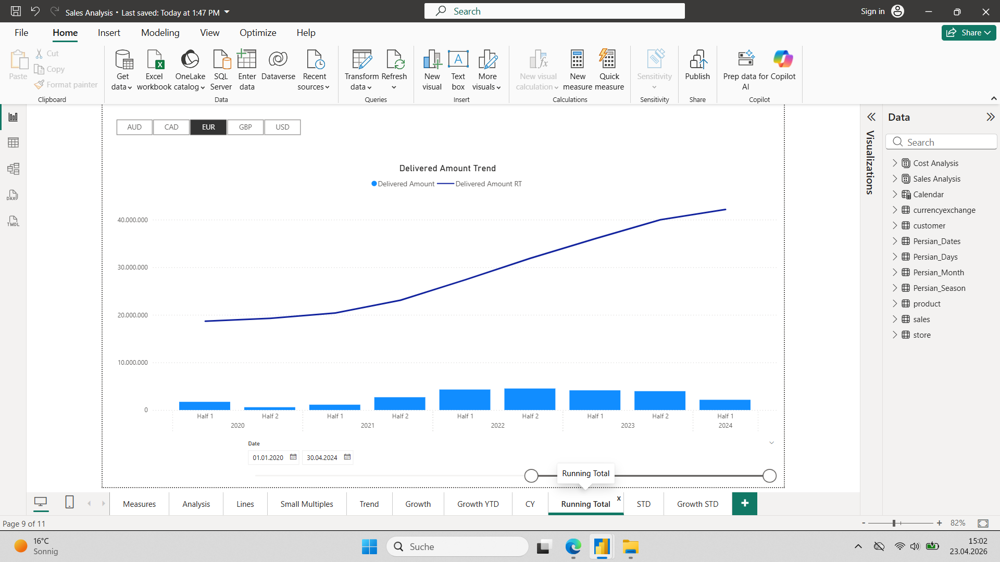

This visualization shows cumulative sales over time.

It helps understand long-term growth patterns and overall business expansion.

---

### 9. Sales Performance by Currency
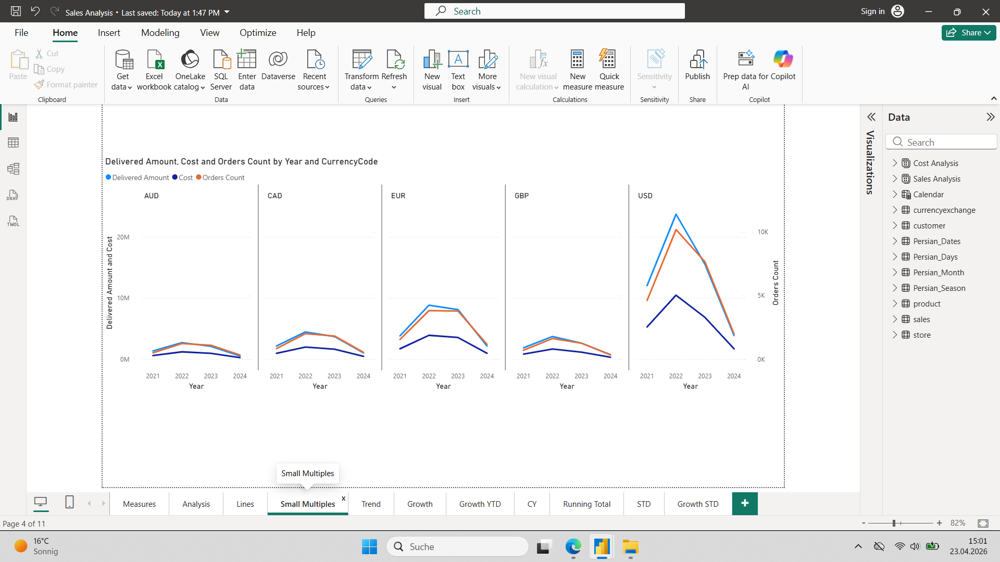

This section compares sales, cost, and order count across different currencies.

It enables cross-market performance analysis and highlights regional differences.

---

### 10. Season-to-Date (STD) Sales Comparison vs Last Year
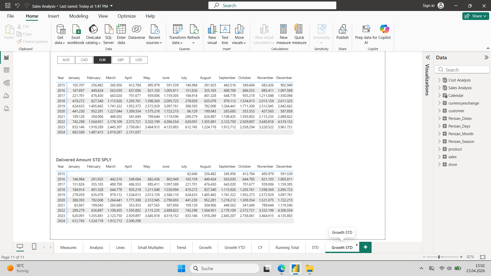

This section provides a Season-to-Date comparison against last year.

It helps evaluate seasonal performance and detect deviations from expected patterns.

---

### 11. Seasonality and STD Trend Analysis
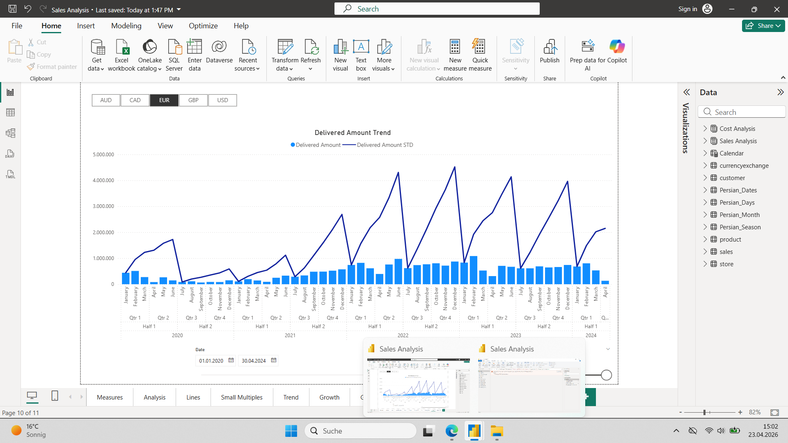

This visualization highlights seasonal trends and STD performance over time.

It is useful for identifying recurring patterns and supporting forecasting decisions.

---

## 📈 Key Insights

- Sales show clear seasonal patterns, especially in Q2 and Q4
- Significant growth observed in recent years followed by slight decline in 2024
- Certain brands dominate revenue contribution
- Multi-currency analysis reveals strong regional differences
- Running total indicates steady long-term growth despite short-term fluctuations

---

## 🛠 Tools & Technologies

- Power BI (Data Visualization)
- DAX (Time Intelligence & KPIs)
- Data Modeling (Star Schema)
- Power Query (Data Transformation)

---

## 📎 How to Use
1. Open the Power BI file (.pbix)
2. Use filters (Brand, Currency, Date)
3. Navigate across tabs:
   - Measures
   - Analysis
   - Trend
   - Growth
   - Running Total
   - STD / YTD

---

### 📊 What’s inside:
- Sales Analysis Dashboard
- Time Intelligence (MTD, QTD, YTD, STD)
- Growth Analysis (YoY, YTD, STD)
- Brand Performance Analysis
- Trend and Forecast Insights

## 📬 Contact
If you have any questions or feedback, feel free to reach out.
